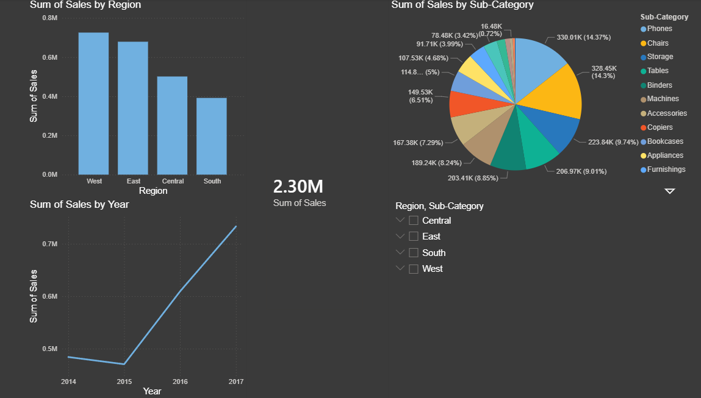

# 📊 Sales Analysis Dashboard (Power BI)

## 📌 Project Overview

This project presents a Sales Analysis Dashboard created using Power BI. It helps analyze sales performance across different regions, categories, and time periods.

## 🛠 Tools Used

* Power BI
* Excel / CSV Dataset

## 📈 Key Features

* Sales by Region
* Category-wise Analysis
* Monthly Sales Trends
* Interactive Filters

## 📷 Dashboard Preview

## 🎯 Insights

* West region has highest sales
* Sales increased over years
* Some categories contribute more to revenue

## 🚀 Conclusion

This dashboard helps in understanding business performance and supports data-driven decision making.
